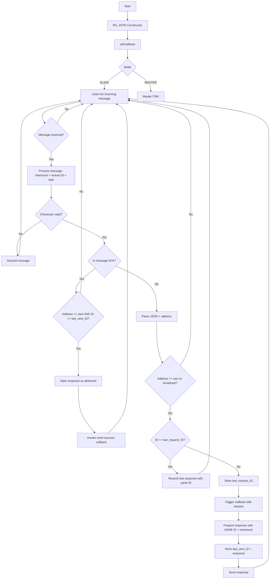
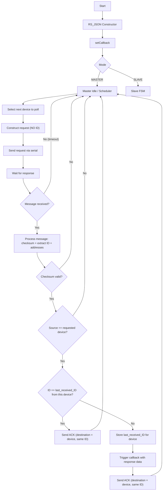

Slave

```mermaid
flowchart TD

    A[Start] --> B[RS_JSON Constructor]
    B --> C[setCallback<callback>]
    C --> D{Mode}

    D -->|SLAVE| E[Listen for incoming message]
    D -->|MASTER| Z[Master FSM]

    %% --- RECEIVE ---
    E --> F{Message received?}
    F -->|No| E
    F -->|Yes| G[Process message: checksum + extract ID + type]

    G --> H{Checksum valid?}
    H -->|No| I[Discard message]
    I --> E

    H -->|Yes| T{Is message ACK?}

    %% --- ACK HANDLING ---
    T -->|Yes| U{Address == own AND ID == last_sent_ID?}
    U -->|No| E
    U -->|Yes| V[Mark response as delivered]
    V --> W[Invoke send-success callback]
    W --> E

    %% --- REQUEST FLOW ---
    T -->|No| J[Parse JSON + address]

    J --> K{Address == own or broadcast?}
    K -->|No| E

    K -->|Yes| L{ID == last_request_ID?}

    %% --- DUPLICATE REQUEST ---
    L -->|Yes| Y[Resend last response with same ID]
    Y --> E

    %% --- NEW REQUEST ---
    L -->|No| M[Store last_request_ID]

    M --> N[Trigger callback with request]

    N --> O[Prepare response with SAME ID + checksum]

    O --> P[Store last_sent_ID + response]

    P --> Q[Send response]

    Q --> E
```

Master

```mermaid
flowchart TD

    A[Start] --> B[RS_JSON Constructor]
    B --> C[setCallback<callback>]
    C --> D{Mode}

    D -->|MASTER| E[Master Idle / Scheduler]
    D -->|SLAVE| Z[Slave FSM]

    %% --- SEND REQUEST ---
    E --> F[Select next device to poll]
    F --> G["Construct request (NO ID)"]
    G --> H[Send request via serial]

    H --> I[Wait for response]

    %% --- RECEIVE ---
    I --> J{Message received?}
    J -->|"No (timeout)"| E
    J -->|Yes| K[Process message: checksum + extract ID + addresses]

    %% --- VALIDATION ---
    K --> L{Checksum valid?}
    L -->|No| E

    L -->|Yes| M{Source == requested device?}
    M -->|No| E

    %% --- DUPLICATE CHECK ---
    M -->|Yes| N{ID == last_received_ID from this device?}

    %% --- DUPLICATE RESPONSE ---
    N -->|Yes| O["Send ACK (destination = device, same ID)"]
    O --> E

    %% --- NEW RESPONSE ---
    N -->|No| P[Store last_received_ID for device]

    P --> Q[Trigger callback with response data]

    Q --> R["Send ACK (destination = device, same ID)"]

    R --> E
```