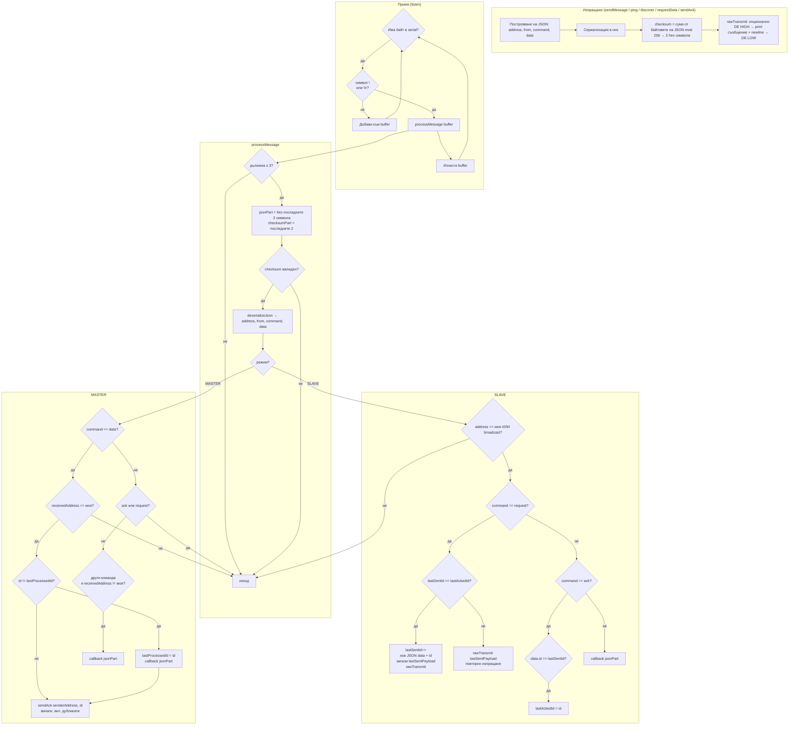

Ето обобщена **Mermaid** диаграма на логиката на `RS_JSON`: сериен прием, проверка на контролна сума, и разклоняване по режим (MASTER/SLAVE) и команда.

**Кратко обяснение:** изходящите съобщения винаги са JSON + двубайтова hex контролна сума и нов ред; при вход `listen` събира до край на реда, после `processMessage` отрязва сумата, валидира я и по режим обработва `request`/`ack`/`data` и останалите команди. На SLAVE при непотвърдено съобщение при нов `request` се праща същият `lastSentPayload`; на MASTER при `data` се дедуплицира по `id`, но **ack се изпраща винаги**, за да може слейвът да напредне с `lastAckedId`.

Ако искаш, мога да добавя отделна мини-диаграма само за последователността MASTER `requestData` ↔ SLAVE `data` ↔ MASTER `ack`.