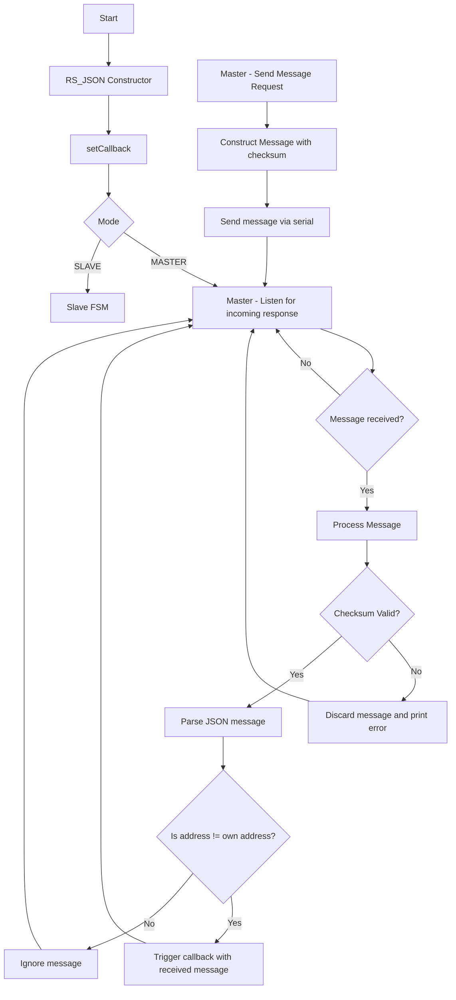
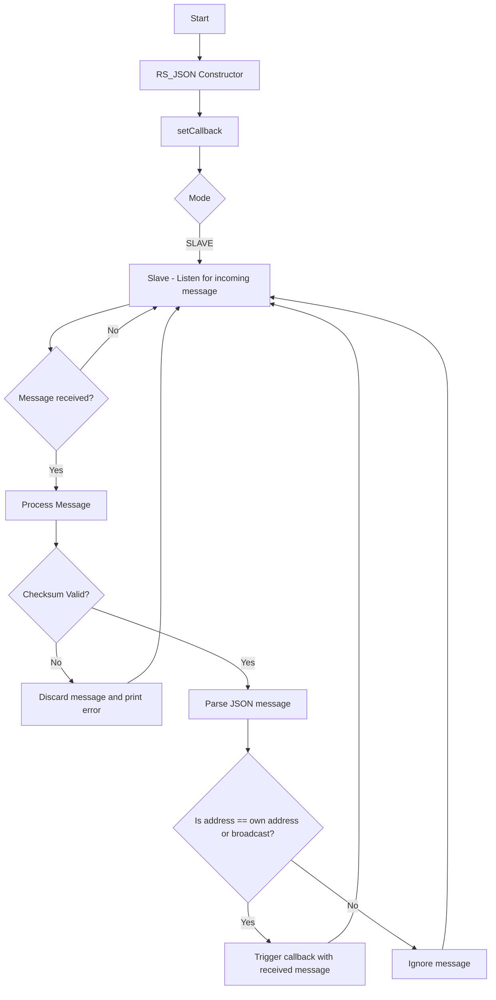

### Контролен поток за режим **MASTER**:

Тази диаграма на контролния поток показва основните действия, които се извършват в модула `RS_JSON`. Тя обхваща основните функции като инициализация, изпращане на съобщения, получаване и обработка на съобщения, валидиране на контролни суми и обработка на събития:

### Какво е показва диаграмата:

1. **RS_JSON Constructor**: Тук започва процесът с инициализацията на обекта. След това се задава **callback**.

2. **Избор на режим (MASTER или SLAVE)**:

   * **MASTER** режимът започва с **слушане за отговори** (`Master - Listen for incoming response`).
   * **SLAVE** режимът преминава в състояние за обработка на съобщения чрез **Slave FSM**, което е подходящо за логиката на устройството в този режим.

3. **MASTER режим**:

   * Ако **MASTER** трябва да изпрати съобщение, започва с **изпращане на съобщение** (`Master - Send Message Request`), след което съобщението се изгражда и изпраща със съответната контролна сума.
   * След изпращането, **MASTER** отново влиза в **слушане за отговори** (`Listen for incoming response`).

4. **Обработка на съобщение в MASTER режим**:

   * Когато **MASTER** получи съобщение, първо се проверява дали е валидно чрез **контролна сума**.
   * Ако контролната сума не съвпада, съобщението се изхвърля с **грешка**.
   * Ако е валидно, съобщението се парсира и проверява дали е адресирано към устройството.
     * Ако **адресът съвпада** със собствения, се извиква **callback**.
     * Ако **адресът не съвпада**, съобщението се игнорира.
---

### Контролен поток за режим **SLAVE**:

### Обяснение на стъпките:

1. **Слушане за входящо съобщение** (`Slave - Listen for incoming message`):

   * SLAVE режимът постоянно слуша за входящи съобщения от **MASTER** или други устройства.

2. **Получаване на съобщение**:

   * Когато съобщение е получено, то се проверява за валидност чрез **контролна сума**.

3. **Проверка на контролна сума**:

   * Ако контролата на съобщението не е валидна, съобщението се изхвърля и се отпечатва грешка.

4. **Парсване на съобщението**:

   * Ако контролната сума е валидна, съобщението се парсира в JSON формат.

5. **Адресиране на съобщението**:

   * Ако съобщението е адресирано към SLAVE устройството (или към "broadcast"), извиква се **callback** функцията, която обработва съобщението.
   * Ако съобщението не е адресирано към SLAVE устройството, то се игнорира.

6. **Цикличност**:

   * След обработката на съобщението, **SLAVE** отново преминава в състояние на слушане за ново съобщение.
