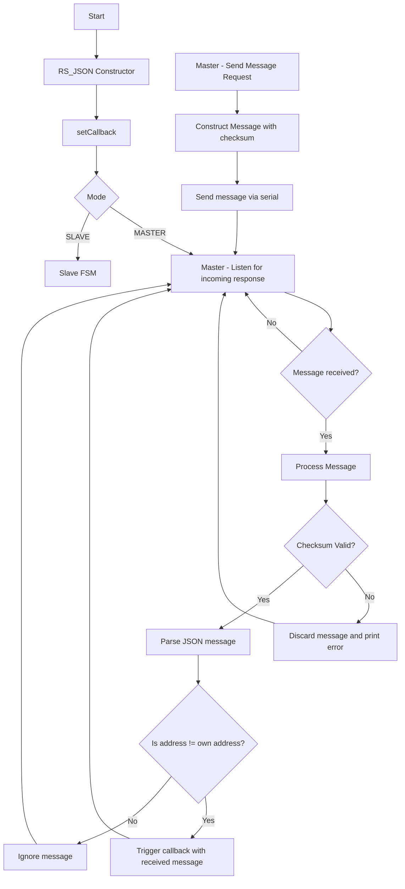
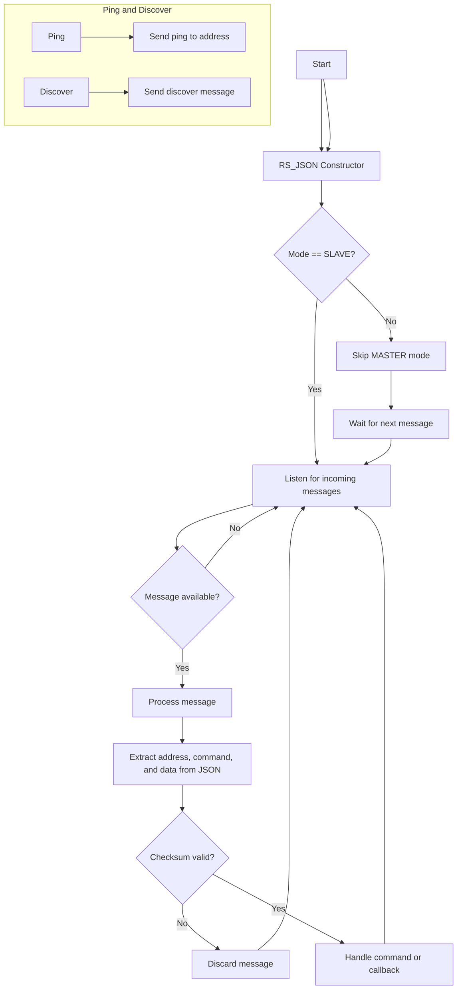

### Контролен поток за режим **MASTER**:

Тази диаграма на контролния поток показва основните действия, които се извършват в модула `RS_JSON`. Тя обхваща основните функции като инициализация, изпращане на съобщения, получаване и обработка на съобщения, валидиране на контролни суми и обработка на събития:

### Какво е показва диаграмата:

1. **RS_JSON Constructor**: Тук започва процесът с инициализацията на обекта. След това се задава **callback**.

2. **Избор на режим (MASTER или SLAVE)**:

   * **MASTER** режимът започва с **слушане за отговори** (`Master - Listen for incoming response`).
   * **SLAVE** режимът преминава в състояние за обработка на съобщения чрез **Slave FSM**, което е подходящо за логиката на устройството в този режим.

3. **MASTER режим**:

   * Ако **MASTER** трябва да изпрати съобщение, започва с **изпращане на съобщение** (`Master - Send Message Request`), след което съобщението се изгражда и изпраща със съответната контролна сума.
   * След изпращането, **MASTER** отново влиза в **слушане за отговори** (`Listen for incoming response`).

4. **Обработка на съобщение в MASTER режим**:

   * Когато **MASTER** получи съобщение, първо се проверява дали е валидно чрез **контролна сума**.
   * Ако контролната сума не съвпада, съобщението се изхвърля с **грешка**.
   * Ако е валидно, съобщението се парсира и проверява дали е адресирано към устройството.
     * Ако **адресът съвпада** със собствения, се извиква **callback**.
     * Ако **адресът не съвпада**, съобщението се игнорира.
---

### Контролен поток за режим **SLAVE**:

### Обяснение на контролния поток в **SLAVE** режим:

1. **Конструктор**: Модулът се инициализира чрез конструктора, който задава режим и други параметри. В режим **SLAVE** модула ще слуша за входящи съобщения, които са адресирани до него или са broadcast съобщения.

2. **Слушане за съобщения**: Основната задача на **SLAVE** устройството е да слуша за съобщения в серийния порт чрез метода `listen`. Когато се появи ново съобщение, то се обработва.

3. **Обработка на съобщения**: След като съобщението е получено, то се обработва, като се извличат адреса, командата и данните от JSON-а.

4. **Валидация на контролна сума**: Проверява се дали контролната сума на съобщението съвпада с тази, която е изчислена от самото съобщение.

5. **Извършване на действия в зависимост от командата**: Ако сумата е валидна, се обработва командата и се извиква callback функцията, ако такава е зададена и условията за извикването са изпълнени (например адресът на съобщението съвпада с адреса на устройството или е broadcast съобщение).

6. **Ping и Discover**: Модулът може да изпрати **ping** съобщения или да поиска открития на устройства в мрежата.

Това обхваща основните стъпки за обработка на съобщения и тяхната валидация при режим **SLAVE**.

6. **Ping и Discover**: Методите `ping` и `discoverDevices` изпращат специфични съобщения за откриване на устройства или пинг.

Тази диаграма обхваща всички основни действия, като изпращане и получаване на съобщения, валидация на данни и обработка на команди.
