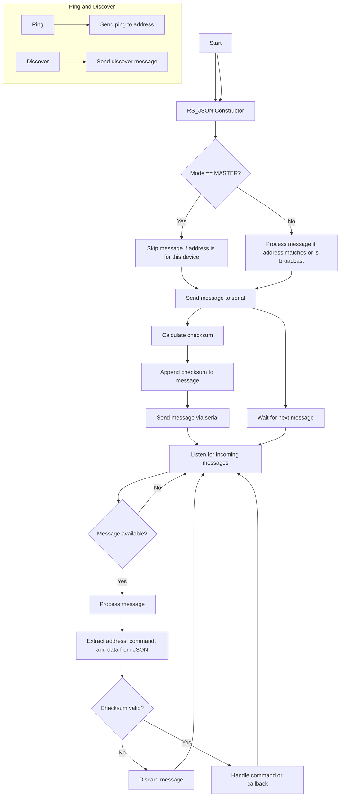

Тази диаграма на контролния поток показва основните действия, които се извършват в модула `RS_JSON`. Тя обхваща основните функции като инициализация, изпращане на съобщения, получаване и обработка на съобщения, валидиране на контролни суми и обработка на събития:

### Обяснение на контролната диаграма:

1. **Конструктори**: Има два конструктора за инициализация на обекта `RS_JSON`. В зависимост от режима на работа и дали е зададен `dePin`, ще се използва различен конструктор.

2. **Основен цикъл**: В метода `listen` се проверява дали има нови съобщения в серийния порт. Ако има, те се обработват и се валидират.

3. **Валидация на сума**: При всяко получаване на съобщение се изчислява контролна сума и се сравнява с последните два символа от съобщението.

4. **Изпращане на съобщения**: Когато е необходимо да се изпрати съобщение, се създава JSON обект, добавя се контролна сума и съобщението се изпраща през серийния порт. В режим MASTER се изпращат съобщения без да се обработват тези, адресирани до устройството.

5. **Ping и Discover**: Методите `ping` и `discoverDevices` изпращат специфични съобщения за откриване на устройства или пинг.

Тази диаграма обхваща всички основни действия, като изпращане и получаване на съобщения, валидация на данни и обработка на команди.
